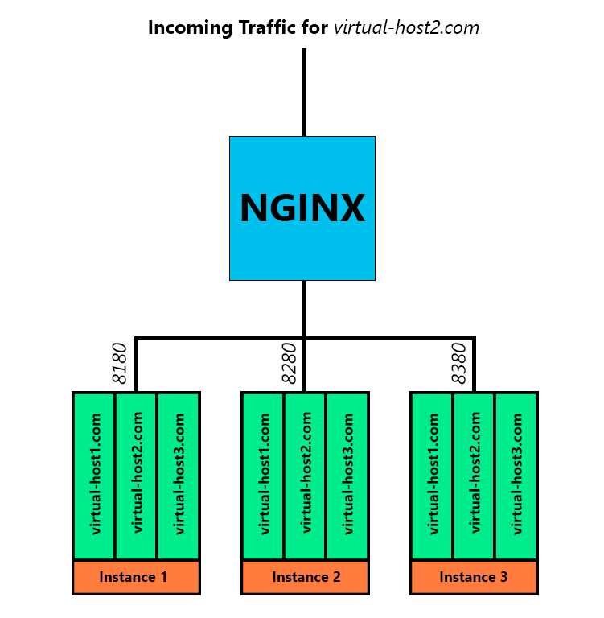

<!-- TOC -->

- [Creating Multiple Server Instances](#creating-multiple-server-instances)
    - [Duplicating our Server Code](#duplicating-our-server-code)
    - [Assigning Server Ports](#assigning-server-ports)
    - [Creating Startup Scripts](#creating-startup-scripts)
- [Loadbalancing - Vertical Cluster](#loadbalancing---vertical-cluster)
    - [Setting Up NGINX](#setting-up-nginx)

<!-- /TOC -->


I now want to create several instances of the Tomcat server on a single LINUX server. This is the kind of setup you would use for an microservice driven web app. For this case I will create 1:1 copies of the original server and latter add NGINX in front of it to balance out the load.


## Creating Multiple Server Instances

### Duplicating our Server Code

Start by copying __everything but__ the `/lib` and `/bin` directory from your Tomcat installation dir into 3 new folder next to the installation dir - `instance1`, `instance2` and `instance3`:


```bash
Directories
├── apache-tomcat-9.0.41
│  ├── bin
│  ├── conf
│  ├── lib
│  ├── logs
│  ├── temp
│  ├── virtual-hosts
│  │  ├── host1
│  │  ├── host2
│  │  └── host3
│  ├── webapps
│  │  ├── boilerplate
│  │  ├── docs
│  │  ├── examples
│  │  ├── host-manager
│  │  ├── manager
│  │  └── ROOT
│  └── work
├── instance1
│  ├── conf
│  ├── logs
│  ├── temp
│  ├── virtual-hosts
│  │  ├── host1
│  │  ├── host2
│  │  └── host3
│  ├── webapps
│  │  ├── boilerplate
│  │  ├── docs
│  │  ├── examples
│  │  ├── host-manager
│  │  ├── manager
│  │  └── ROOT
│  └── work
├── instance2
│  ├── conf
│  ├── logs
│  ├── temp
│  ├── virtual-hosts
│  │  ├── host1
│  │  ├── host2
│  │  └── host3
│  ├── webapps
│  │  ├── boilerplate
│  │  ├── docs
│  │  ├── examples
│  │  ├── host-manager
│  │  ├── manager
│  │  └── ROOT
│  └── work
├── instance3
│  ├── conf
│  ├── logs
│  ├── temp
│  ├── virtual-hosts
│  │  ├── host1
│  │  ├── host2
│  │  └── host3
│  ├── webapps
│  │  ├── boilerplate
│  │  ├── docs
│  │  ├── examples
│  │  ├── host-manager
│  │  ├── manager
│  │  └── ROOT
│  └── work
```


### Assigning Server Ports

Now we need to give each instance a unique set of ports to operate on. This can be set inside the `./conf/server.xml` of each instance, e.g. `nano /opt/tomcat/instance1/conf/server.xml`:


```xml
<Server port="8105" shutdown="SHUTDOWN">

...

<Connector port="8180" protocol="HTTP/1.1" connectionTimeout="20000" />

...

<!-- <Connector protocol="org.apache.coyote.http11.Http11NioProtocol"
               port="8443" maxThreads="200"
               scheme="https" secure="true" SSLEnabled="true"
               keystoreFile="/opt/tomcat/ssl/sslKey.jks" keystorePass="instar"
               clientAuth="false" sslProtocol="TLS"/> -->

...

<Connector protocol="AJP/1.3" port="8109" />
```

> I am removing the self-signed certificate as I am going to use NGINX later to handle my CA certificate.


| Instance | Shutdown Port | HTTP Port | AJP Port |
| -- | -- | -- | -- |
| Base      | 8005 | 8080 | 8009 |
| Instance1 | 8105 | 8180 | 8109 |
| Instance2 | 8205 | 8280 | 8209 |
| Instance3 | 8305 | 8380 | 8309 |


### Creating Startup Scripts

Now we need a new `scripts` folder inside the tomcat directory to create startup and stop scripts for our new instances - `mkdir /opt/tomcat/scripts`:


```bash
nano /opt/tomcat/scripts/start-instance1.sh
```

```sh
#!/bin/bash

export CATALINA_HOME="/opt/tomcat/latest"
export CATALINA_BASE="/opt/tomcat/instance1"

cd $CATALINA_HOME/bin
./startup.sh
```


```bash
nano /opt/tomcat/scripts/stop-instance1.sh
```

```sh
#!/bin/bash

export CATALINA_HOME="/opt/tomcat/latest"
export CATALINA_BASE="/opt/tomcat/instance1"

cd $CATALINA_HOME/bin
./shutdown.sh
```


Create both scripts for all your instances:


```bash
scripts
├── start-instance1.sh
├── start-instance2.sh
├── start-instance3.sh
├── stop-instance1.sh
├── stop-instance2.sh
└── stop-instance3.sh
```

And make those scripts executable with `chmod -R 755 /opt/tomcat/scripts`. You can now start all instances by running each startup script like:


```bash
/opt/tomcat/scripts/start-instance1.sh

Using CATALINA_BASE:   /opt/tomcat/instance1
Using CATALINA_HOME:   /opt/tomcat/latest
Using CATALINA_TMPDIR: /opt/tomcat/instance1/temp
Using JRE_HOME:        /usr
Using CLASSPATH:       /opt/tomcat/latest/bin/bootstrap.jar:/opt/tomcat/latest/bin/tomcat-juli.jar
Using CATALINA_OPTS:   
Tomcat started.
```


After making sure that the ports you specified for those 3 instances: `ufw allow 8180/tcp`, `ufw allow 8280/tcp`, `ufw allow 8380/tcp` - try accessing the 4 different versions of the virtual host we created earlier with your browser:


```bash
http://virtual-host1.com:8180/
http://virtual-host1.com:8280/
http://virtual-host1.com:8380/
```


## Loadbalancing - Vertical Cluster

I now have 3 virtual hosts (instances) that I can target by a unique port:


* Port 8180 -> Instance 1
* Port 8280 -> Instance 2
* Port 8380 -> Instance 3


Each of them hosts 3 web applications that will respond to one of the following addresses:


* virtual-host1.com
* virtual-host2.com
* virtual-host3.com


> Before I only added these addresses to the PC I am working on. I now also have to add them to `/etc/hosts` on my LINUX server and resolve them to `127.0.0.1`. Verify that you can reach your virtual host before proceeding:


```bash
curl virtual-host1.com:8180 

<!DOCTYPE html PUBLIC "-//W3C//DTD HTML 4.01 Transitional//EN" "http://www.w3.org/TR/html4/loose.dtd">
<html>
<head>
<meta http-equiv="Content-Type" content="text/html; charset=ISO-8859-1">
<title>Tomcat Boilerplate</title>
</head>
<body>

<h1>Hello from Virtual Host 1</h1>
<h3>Virtual Host Address: http://virtual-host1.com:8180/</h3>
</body>
</html># 
```


### Setting Up NGINX

I am going to use the [NGINX Upstream Module](http://nginx.org/en/docs/http/ngx_http_upstream_module.html) to set up a Round-Robin traffic balancing for the 3 virtual hosts that we just created:





```conf
server {
    listen 80;
    listen [::]:80;

    server_name virtual-host1.com virtual-host2.com virtual-host3.com;

    return 301 https://$server_name$request_uri;
}


upstream tc1_servlets {
    server virtual-host1.com:8180;
    server virtual-host1.com:8280;
    server virtual-host1.com:8380;
}

server {
    listen      443 ssl http2;
    listen      [::]:443 ssl http2;
    include     conf.d/self-signed.conf;
    include     conf.d/ssl-params.conf;
    include     conf.d/header.conf;

    server_name virtual-host1.com;

    location = / {
        proxy_pass http://tc1_servlets;
    }

    error_page  404              /404.html;
    error_page  500 502 503 504  /50x.html;
    location = /50x.html {
        root   /usr/share/nginx/html;
    }
}


upstream tc2_servlets {
    server virtual-host2.com:8180;
    server virtual-host2.com:8280;
    server virtual-host2.com:8380;
}

server {
    listen      443 ssl http2;
    listen      [::]:443 ssl http2;
    include     conf.d/self-signed.conf;
    include     conf.d/ssl-params.conf;
    include     conf.d/header.conf;

    server_name virtual-host2.com;

    location = / {
        proxy_pass http://tc2_servlets;
    }

    error_page  404              /404.html;
    error_page  500 502 503 504  /50x.html;
    location = /50x.html {
        root   /usr/share/nginx/html;
    }
}


upstream tc3_servlets {
    server virtual-host3.com:8180;
    server virtual-host3.com:8280;
    server virtual-host3.com:8380;
}

server {
    listen      443 ssl http2;
    listen      [::]:443 ssl http2;
    include     conf.d/self-signed.conf;
    include     conf.d/ssl-params.conf;
    include     conf.d/header.conf;

    server_name virtual-host3.com;

    location = / {
        proxy_pass http://tc3_servlets;
    }

    error_page  404              /404.html;
    error_page  500 502 503 504  /50x.html;
    location = /50x.html {
        root   /usr/share/nginx/html;
    }
}
```